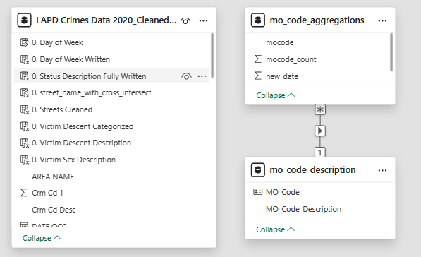
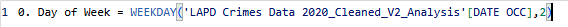
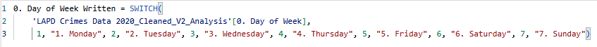
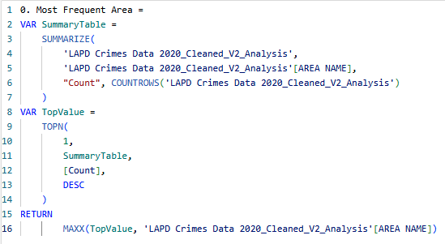
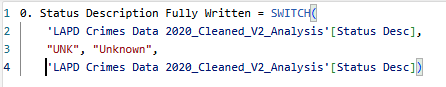
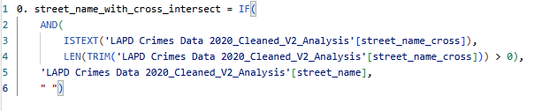
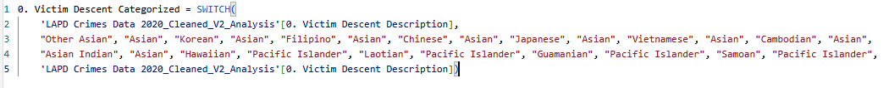
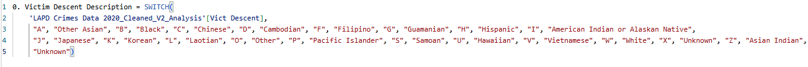
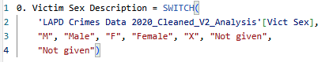

# Data-Analytics-Portfolio
Los Angeles Police Department - Crime Statistics Analysis

## Introduction
Welcome to my first official GitHub ReadMe file! My name is Milo, and I am currently in the process of educating myself in the field of Data Analytics to make it my full-time profession. For this project, I decided to analyze the crime data in the City of Los Angeles from 2020 until 2025. The data of 2024 and 2025 is incomplete in this dataset, but I decided to still use the data, since the personal practice outweighs the data usability. 

Note from LAPD website:
> "This dataset reflects incidents of crime in the City of Los Angeles dating back to 2020. This data is transcribed from original crime reports that are typed on paper and therefore there may be some inaccuracies within the data. Some location fields with missing data are noted as (0°, 0°). Address fields are only provided to the nearest hundred block in order to maintain privacy. This data is as accurate as the data in the database. Please note questions or concerns in the comments."

## Problem Statements
**Nine statements** or questions have been formulated to solve within this dataset. 
1. Analyze victim age, sex, and most common area for different types of crime.
2. Identify the most common types of weapons used.
    - Does this differ per crime type?
3. How have crime rates evolved year-over-year
    - Compare crime patterns during COVID lockdowns (2020–2021) vs. post-lockdown.
    - Do crime rates differ per day of week?
4. What time in the day are most crimes committed?
    - Break it down by crime type (e.g., assaults at night vs. thefts in the morning).
5. Use LAT and LON coordinates to create a heatmap of high-crime zones within the City of Los Angeles
    - What are the high-crime zones in the City of Los Angeles?
    - Break it down by victim decent to find differences in high-crime zones per decent
6. Rank areas by frequency or severity of crimes.
    - Determine the most dangerous streets
    - Also determine the most dangerous intersections
7. Are certain crimes (e.g., robbery, assault) more prevalent against specific groups?
    - Identify whether specific groups are disproportionately targeted in certain areas.
8. Extract and visualize trends from Mocodes to see popular tactics or criminal behavior.
9. What percentage of crimes have an "IC" (investigation complete) or other statuses?
    - Which types of crimes are most likely to remain unresolved?

## Skills Demonstrated
**MySQL** 
- Data Cleaning
- Standardization
- Removing outliers
- Data Analysis

**Microsoft Power BI** 
- Data Transformation
- Data Modeling 
- Data Modeling Hierarchy 
- DAX Measure Calculations
- New Column Calculations
- Visualization
    - Graph & Chart Creation
    - Filters
    - Data Drilling

## Data Sourcing
The data used for this analysis has been directly downloaded from the City of Los Angeles Police Department Governmental [website](https://data.lacity.org/Public-Safety/Crime-Data-from-2020-to-Present/2nrs-mtv8/about_data)

> Data last updated: April 30, 2025

## Data Cleaning & Transformation
**Data Cleaning**
Link to SQL file: [link](MySQL-Projects/Data%20Cleaning/LAPD_data_cleaning.sql)

**Data Transformation**
Link to file with all DAX measure and calculated column formulas used for this project: [link](PowerBI-Projects/dax_and_columns)

**Or** click here to scroll to the extra material page in this ReadMe file to view them in a clear overview [link](#anchor-extra-materials)

## Data Modeling 
One simple many to one (* > 1) data model was used to create the mo-code analysis page. For this page, I exported a table including each individual mo-code from each individual crime scene plus their count. I downloaded the mo-codes plus description from the LAPD website, and modeled them together to add the description to my own table. 

## Visualizations & Analysis

## Conclusions

## Recommendations

## Extra Materials 
DAX measures and calculated columns used for this project:

- To add column with days in the week, expressed as numbers 1-7 (mon-sun)

- To add column with days in week, expressed in words instead of numbers

- To add a measure to calculate the area with the most amount of crimes for the card visual on page one

- To change value "UNK" to "Unknown" within 'status' column to improve readability of visualisation on case statuses

- To find the streets with street intersections

- To categorise the victim descents to improve readability of visualisation on descent versus area of crime

- To write out the known descents of victims in full, instead of using the letter-code

- To write out the known genders of victims in full, instead of using the letter-code

